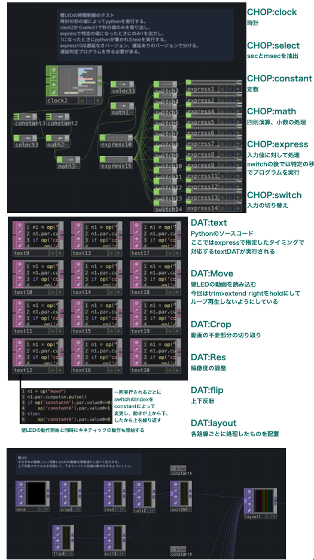

# 壁フェス2022

**"color of 新宿ステーション"**

「新宿駅の列車運行」を壁の動きや映像で表現することを目指し、Touch Designerというノードベースのビジュアルプログラミングツールを活用しました。

Pythonを用いて動作のタイミング制御を行い、Twitter APIから取得した遅延情報に基づいてアニメーションの速度を調整しています

時間帯・天気によって背景・音楽・効果音が変化し、時刻表をもとにしたダイヤ情報と遅延情報によって各路線カラーのアニメーション再生頻度が変化します。

https://github.com/user-attachments/assets/38e94051-a2e8-4038-a0b1-e60b1542932c

### 説明資料

アニメーションと壁の動きを同時に生成(左からアニメーション、壁の動き、変化速度)

<video src="img/td1013c.mov" controls="true">プレゼン用.mp4</video>

プレゼンテーションでのデモンストレーション

<video src="img/プレゼン用.mp4" controls="true">プレゼン用.mp4</video>

(うまく表示されない場合は`/img`内を直接参照してください)

### 関連リンク

イベント詳細

> [P.I.C.S.協賛「壁フェス Kinetic Wall Festival 2022」が工学院大学 新宿アトリウムにて開催。](https://www.pics.tokyo/news/2022/kinetic-wall-festival2022/)

> [壁フェス Kinetic Wall Festival 2022 最終審査会 開催のお知らせ](https://www.kogakuin.ac.jp/atrium/news/2022120101.html)

> [デジタルで学生たちが競い合う！ - 壁フェス Kinetic Wall Festival 2022最終結果発表](https://news.mynavi.jp/kikaku/20221226-2542360/)

実際の発表会の様子(発表者はプロジェクトメンバーの友人です)

> [壁フェス Kinetic Wall Festival 2022 最終審査会](https://youtu.be/mpwVf4jXQho?t=1719)
